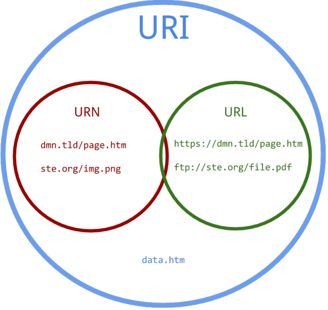

## URI
### URI的概念及其与URL的区别

https://www.cnblogs.com/shoshana-kong/p/10939188.html

## HTTP
### 前端缓存策略
大家可以想象我们使用 a.js 的场景，我们一般都是输入网址，访问一个 html 文件，html文件中会引入 js、css、图片等资源。所以呢，我们在html上做些手脚。我们不让 html 文件缓存，每次访问 html 都去请求服务器。所以浏览器每次都能拿到最新的html资源。a.js 内容更新的时候，我们修改一下 html 中 a.js 的版本号。   
第一次访问 html
```
<script src="http://test.com/a.js?version=0.0.1"></script>
```
浏览器下载0.0.1版本的a.js文件。浏览器再次访问 html，发现还是0.0.1版本的a.js文件，则使用本地缓存。某一天a.js变了，我们的html文件也相应变化如下：
```
<script src="http://test.com/a.js?version=0.0.2"></script>
```
浏览器再次访问html，发现【test.com/a.js?versio… a.js。如此往复。所以，通过设置html不缓存，html引用资源内容变化则改变资源路径的方式，就解决了无法及时得知资源更新的问题。当然除了以版本号来区分，也可以以 MD5hash 值来区分。
如
```
<script src="http://test.com/a.【hash值】.js"></script>
```
使用webpack打包的话，借助插件可以很方便的处理。
### http是无状态的协议